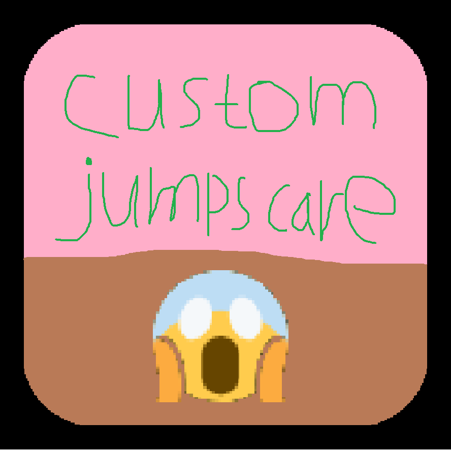

# Custom Jumpscare

My first Geode mod purely for jumpscaring you, with customization.

# Features
- Enable the jumpscare at specific times
- Set a separate chance for each occasion
- Choose your very own image to jumpscare you
- Set fade-in, max opacity and fade-out values for the jumpscare 

All of the above can be found in the mod's settings. 

# Credits

- Infinity (@limitedtime_fr on Discord) for the idea
- Developers in the Geode SDK server for guiding me on creating mods using Geode SDK
